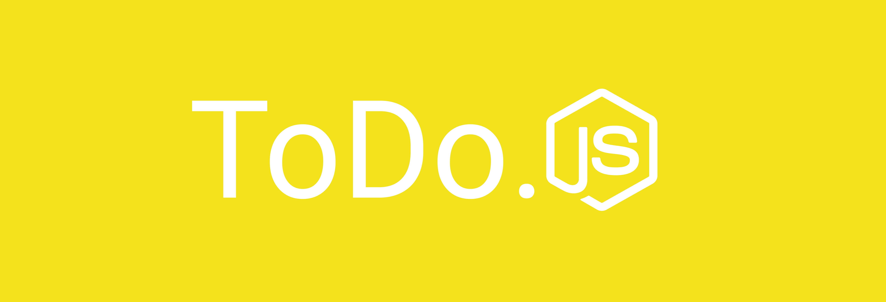

[![Contributors][contributors-shield]][contributors-url]
[![Forks][forks-shield]][forks-url]
[![Stargazers][stars-shield]][stars-url]
[![Issues][issues-shield]][issues-url]
[![MIT License][license-shield]][license-url]
[![Linkedin][linkedin-shield]][linkedin-url]


<!-- PROJECT LOGO -->
<br />
<p align="center">
  <a href="https://github.com/boazcavalcante/todo.js_backend">
    
  </a>

  <h3 align="center">ToDo.JS</h3>

  <p align="center">
    A To-Do List App made with JavaScript (Node.JS and React.JS)
    <br />
    <!--
    <a href="https://github.com/othneildrew/Best-README-Template">View Demo</a>
    ·
    -->
    <a href="https://github.com/boazcavalcante/todo.js_backend/issues">Report Bug</a>
    ·
    <a href="https://github.com/boazcavalcante/todo.js_backend/issues">Request Feature</a>
  </p>
</p>


<!-- ABOUT THE PROJECT -->
## About The Project

This repository corresponds to the backend of the ToDo.JS project, created to practice and apply the concepts of API and SPA, as well as test new packages and tools in the javascript ecosystem.

### Built With
* [Node.JS](https://nodejs.org/en/)
* [Express](https://expressjs.com/)
* [SQLite](https://www.sqlite.org/index.html)


<!-- GETTING STARTED -->
## Getting Started

To get a local copy up and running follow these simple steps.

### Prerequisites

* npm
```sh
npm install npm@latest -g
```

### Installation

1. Clone the repo
```sh
git clone https://github.com/boazcavalcante/todo.js_backend.git
```
2. Install NPM packages
```sh
npm install
```
3. Run the tests
```sh
npm test
```
3. Start the server
```sh
npm start
```


<!-- USAGE EXAMPLES -->
## Usage

To use, just make requests at localhost:3000 (or specified port with '--PORT port_number'), according to the following routes:

1. Create user:
* Route: '/users/register'
* Method: post
* Body: { name: 'user_name', email: 'user_email', password: 'user_password' }
* Expected response: { message: 'User created' }

2. Signin user:
* Route: '/users/authenticate'
* Method: post
* Body: { email: 'user_email', password: 'user_password' }
* Expected response: { user: { name: 'user_name', email: 'user_email' }, token: 'user_token' }

3. Update user:
* Route: '/users/'
* Method: put
* Header: 'Authorization' : 'Bearer user_token'
* Body: { property: 'value' }
* Expected response: { message: 'User updated' }

4. Delete user:
* Route: '/users' 
* Method: delete
* Header: 'Authorization' : 'Bearer user_token'
* Expected response: { message: 'User deleted' }

5. Create item:
* Route: '/items' 
* Method: post
* Header: 'Authorization' : 'Bearer user_token'
* Body: { title: 'item_title' }
* Expected response: { message: 'Item created' }

6. List user items:
* Route: '/items' 
* Method: get
* Header: 'Authorization' : 'Bearer user_token'
* Expected response: [item 1, item 2, item 3, ...]

7. Update item:
* Route: '/items' 
* Method: put
* Header: 'Authorization' : 'Bearer user_token'
* Body: { id: 'item_id', property: 'value' }
* Expected response: { message: 'Item updated' }

8. Delete item:
* Route: '/items' 
* Method: delete
* Header: 'Authorization' : 'Bearer user_token'
* Body: { id: 'item_id' }
* Expected response: { message: 'Item deleted' }

<!-- ROADMAP -->
## Roadmap

See the [open issues](https://github.com/boazcavalcante/todo.js_backend/issues) for a list of proposed features (and known issues).

<!-- CONTRIBUTING -->
## Contributing

Any contributions you make are **greatly appreciated**.

1. Fork the Project
2. Create your Feature Branch (`git checkout -b feature/AmazingFeature`)
3. Commit your Changes (`git commit -m 'Add some AmazingFeature'`)
4. Push to the Branch (`git push origin feature/AmazingFeature`)
5. Open a Pull Request


<!-- LICENSE -->
## License

Distributed under the MIT License. See `LICENSE` for more information.


<!-- CONTACT -->
## Contact

Boaz Cavalcante - boazcavalcante1000@gmail.com

Project Link: [https://github.com/boazcavalcante/todo.js_backend](https://github.com/boazcavalcante/todo.js_backend)

___

Readme template by [othneildrew](https://github.com/othneildrew/Best-README-Template)


<!-- MARKDOWN LINKS & IMAGES -->
<!-- https://www.markdownguide.org/basic-syntax/#reference-style-links -->
[contributors-shield]: https://img.shields.io/github/contributors/boazcavalcante/todo.js_backend.svg?style=flat-square
[contributors-url]: https://github.com/boazcavalcante/todo.js_backend/graphs/contributors

[forks-shield]: https://img.shields.io/github/forks/boazcavalcante/todo.js_backend.svg?style=flat-square
[forks-url]: https://github.com/boazcavalcante/todo.js_backend/network/members

[stars-shield]: https://img.shields.io/github/stars/boazcavalcante/todo.js_backend.svg?style=flat-square
[stars-url]: https://github.com/boazcavalcante/todo.js_backend/stargazers

[issues-shield]: https://img.shields.io/github/issues/boazcavalcante/todo.js_backend.svg?style=flat-square
[issues-url]: https://github.com/boazcavalcante/todo.js_backend/issues

[license-shield]: https://img.shields.io/github/license/boazcavalcante/todo.js_backend.svg?style=flat-square
[license-url]: https://github.com/boazcavalcante/todo.js_backend/blob/master/LICENSE

[linkedin-shield]: https://img.shields.io/badge/-LinkedIn-black.svg?style=flat-square&logo=linkedin&colorB=555
[linkedin-url]: https://www.linkedin.com/in/boaz-almeida-405448b8/

[product-screenshot]: images/screenshot.png
